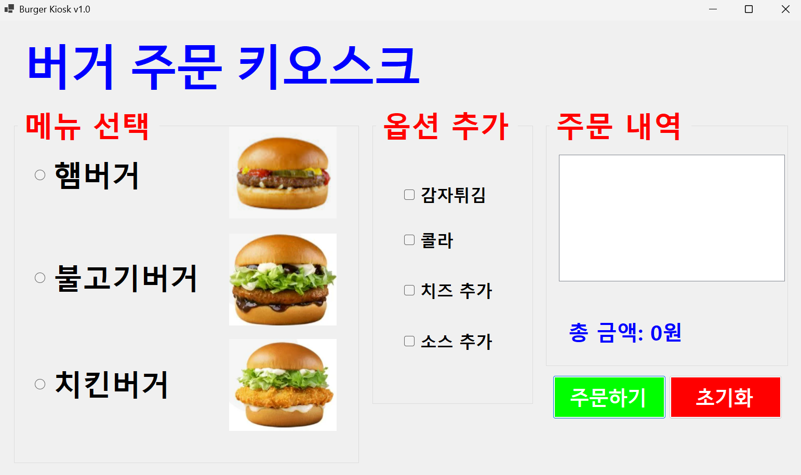
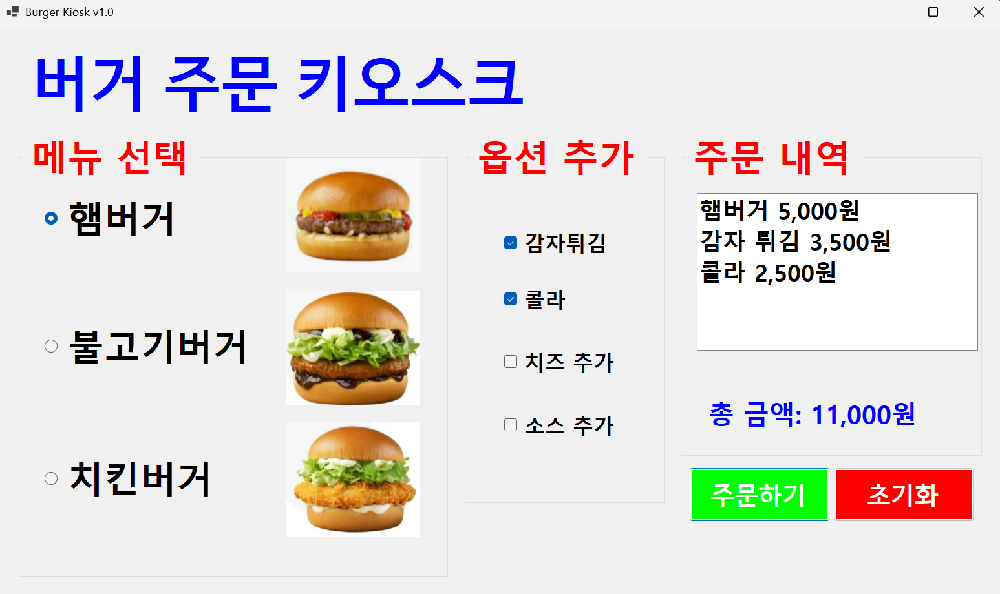
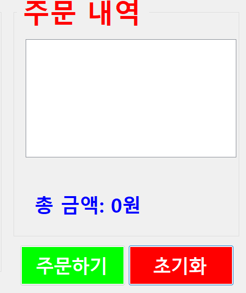
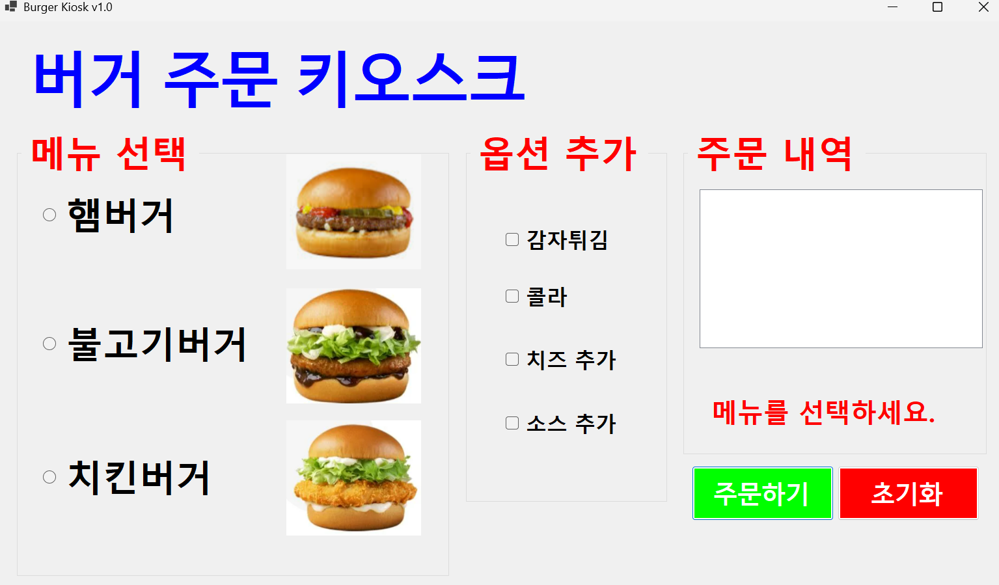
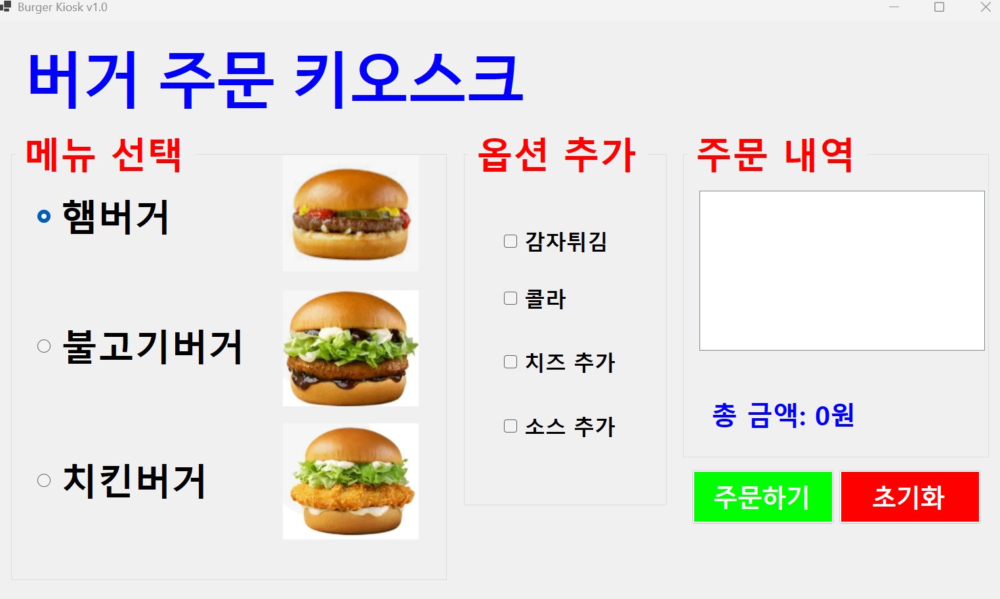

# (C# 코딩) 버거 주문 키오스크

## 개요
- C# 프로그래밍 학습
- 1줄 소개: 메뉴와 추가옵션을 선택하는 키오스크 주문 화면 제작
- 사용한 플랫폼:
	- C#, .NET Windows Forms, Visual Studio, GitHub
- 사용한 컨트롤:
	- CheckBox, RadioButton, Label, Button, GroupBox, ListBox
- 사용한 기술과 구현한 기능:
	- Visual Studio를 이용하여 UI 디자인
	- RadioButton을 활용한 단일 메뉴 선택
	- CheckBox를 활용한 복수 선택 처리
	- 선택된 항목들의 가격을 합산
	- 버튼 클릭 시 전체 로직 실행
	- 선택 여부에 따른 분기 처리
	- 사용자 입력에 따라 화면 즉시 반영
  	- 아무것도 선택하지 않고 주문하기 버튼을 누르면 에러 메시지 표시

## 실행 화면
- 코드의 실행 스크린샷과 구현 내용 설명

- 구현한 내용 (위 그림 참조)
	- UI 구성 : RadioButton과 CheckBox 등을 적절히 배치
	- UI 구성2 : GroupBox로 적절하게 그룹으로 묶음
	- 주문하기 버튼: 주문 내역과 총 금액을 표시
	- 초기화 버튼: 다시 주문할 수 있도록 초기화
	- 첫 실행 시 아무것도 선택되어 있지 않음

## 실행 화면
- 코드의 실행 스크린샷과 구현 내용 설명

- 구현한 내용 (위 그림 참조)
	- 아무것도 선택하지 않고 주문하기 버튼을 누르면 에러 메시지 표시
	- Label을 이용해서 에러 메세지 구현

## 실행 화면
- 코드의 실행 스크린샷과 구현 내용 설명

- 구현한 내용 (위 그림 참조)
	- Tab을 이용해서 GroupBox 사이를 이동하기
	- 방향키를 이용해서 선택 아이템 사이를 이동하기
	- 스페이스바를 이용해서 아이템 선택하기
	- Enter키로 버튼을 누르기

